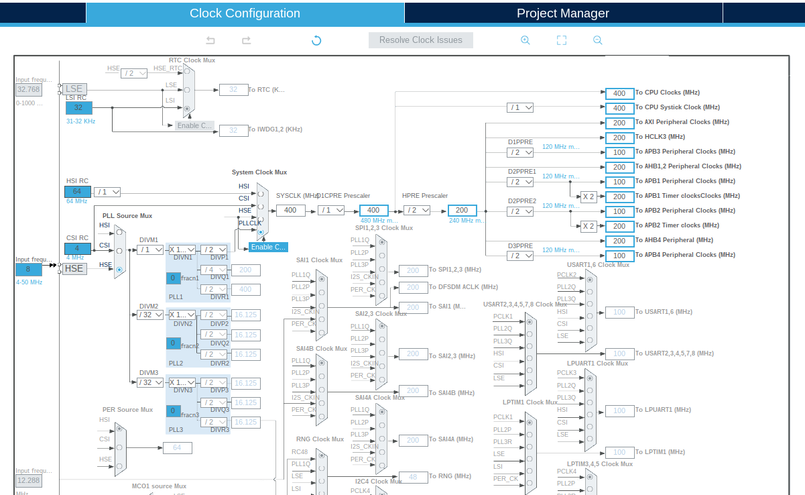
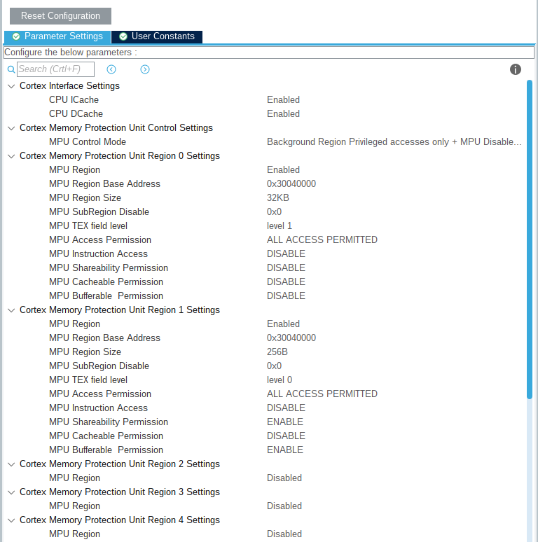
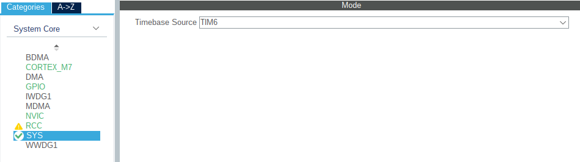
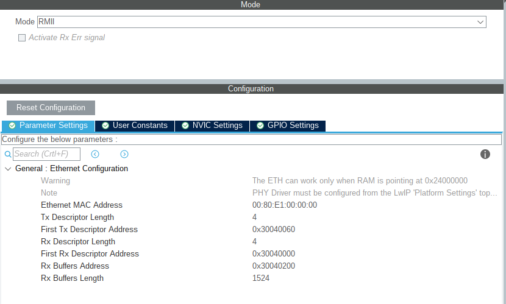
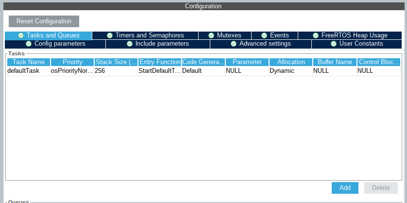
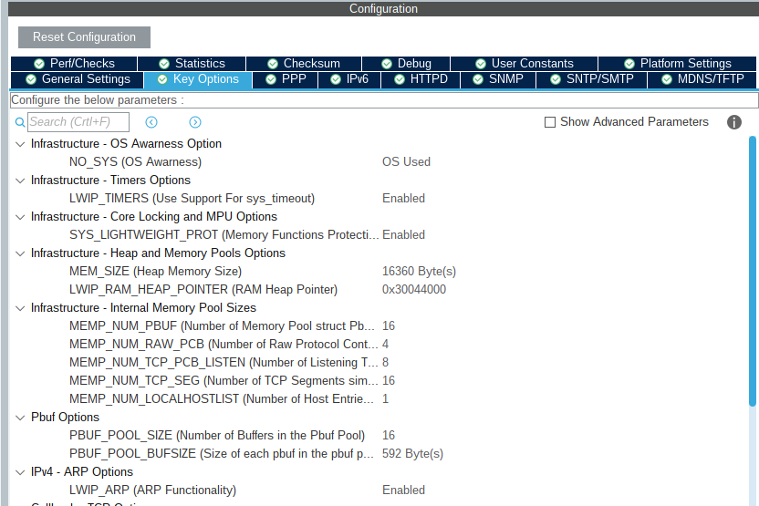
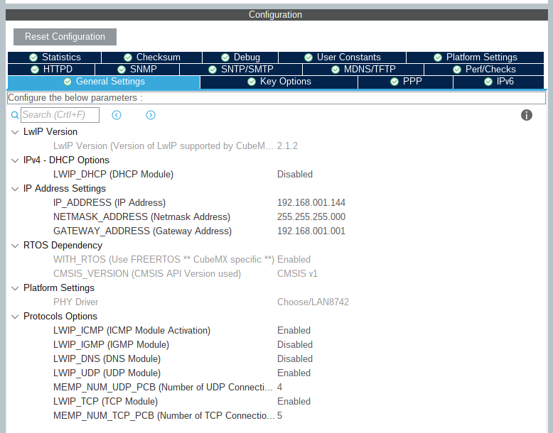
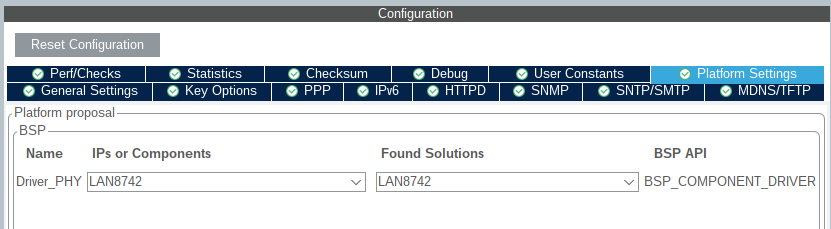
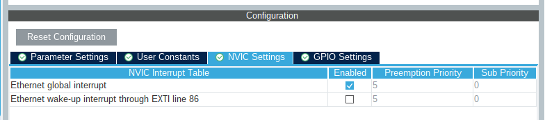

# Starting a new LWIP + FreeRTOS project with CubeMX and System Workbench
Ever since the STM32H7 processors came out, it seems that CubeMX, STM's own generator is not able to generate the correct code integrating the Ethernet interface, LwIP and FreeRTOS. I was aware of the issues running LwIP in raw mode, but it took me a while to get a simple ping working.
There's some information going aroung the Internet, but the step-by-step approach provided in the ST Community forum did not work for me out of the box. With that said, below follow the instructions that I used to get LwIP and FreeRTOS running on the STM32H743ZI Nucleo board.
All information below, projects and code can be downloaded from GIT. Remember _everytime you generate your code in CubeMX, some changes will be lost!_. 

## The CubeMX project
The best way to start is to select the board you're using and tweak it as you go along. Do not initialize the peripherals in their default mode.

### Configure the clock
Set the clock settings as shown in the image below. Modify if you need to add additional interfaces, but best to start with the simplest configuration:


### Configure Cortex M7
Under **System Core -> CORTEX_M7** change the settings as shown below:


On the SYS tab, change the **Timebase Source** to another timer (I used _TIM6_) as FreeRTOS uses the SysTick timer for internal purposes.


### Configure Ethernet Interface
The Ethernet interface is configured as RMII in the Nucleo H743ZI board. The default parameters do not need to be changed:


Confirm the GPIO settings are as shown below:


### Configure FreeRTOS
Activate FreeRTOS. Select CMSIS v1 as the API. On the **Tasks and Queues** tab, confirm that *Stack Size* is set to 256:

**NOTE:** It is possible to use CMSIS_V2, as long as everything else stays the same. Remember, if you re-generate your project you should:
* Confirm your linker file hasn't been rewritten
* Add the missing line on ethernetif.c at the end of _low_level_output()_ 
* Clean the project and re-compile

### Configure LwIP
I like using static IP addresses to start a project, so instead of using DHCP we'll use a static address. Also, the driver for the Nucleo board has to be selected.
In **Key Option** change *MEM_SIZE* to 16360






### Ethernet interrupt settings
The interrupt settings on the Ethernet interface should be set to 5:


### Generate the project
Generate your project at this stage, the following changes are done in the code, inside the linker script at the code.

## Code changes
### Linker script (STM32H743ZITx_FLASH.ld)
The linker script changes are at the beginning in the MEMORY section:
```c
/* Highest address of the user mode stack */
_estack = 0x24080000;    /* end of RAM */ /* Was 0x20020000 */
/* Generate a link error if heap and stack don't fit into RAM */
_Min_Heap_Size = 0x200 ;      /* required amount of heap  */
_Min_Stack_Size = 0x400 ; /* required amount of stack */

/* Specify the memory areas */
MEMORY
{
  FLASH (rx)     : ORIGIN = 0x08000000, LENGTH = 2048K
  DTCMRAM (xrw)      : ORIGIN = 0x20000000, LENGTH = 128K
  RAM_D1 (xrw)   : ORIGIN = 0x24000000, LENGTH = 512K
  RAM_D2 (xrw)   : ORIGIN = 0x30000000, LENGTH = 288K
  RAM_D3 (xrw)   : ORIGIN = 0x38000000, LENGTH = 64K
  ITCMRAM (xrw)  : ORIGIN = 0x00000000, LENGTH = 64K
}
```

Data should be stored in RAM_D1, change all locations where DTCMRAM is selected to RAM_D1:
* change `  } >DTCMRAM AT> FLASH` to  `  } >RAM_D1 AT> FLASH`

At the end of the linker script, add the following code:
```c
/* Modification start */
  .lwip_sec (NOLOAD) : {
    . = ABSOLUTE(0x30040000);
    *(.RxDecripSection) 
    
    . = ABSOLUTE(0x30040060);
    *(.TxDecripSection)
    
    . = ABSOLUTE(0x30040200);
    *(.RxArraySection) 
  } >RAM_D2 AT> FLASH
  /* Modification end */

  /* Remove information from the standard libraries */
  /DISCARD/ :
  {
    libc.a ( * )
    libm.a ( * )
    libgcc.a ( * )
  }

  .ARM.attributes 0 : { *(.ARM.attributes) }
}
```

### main.c
The beginning of the main.c file should have the following function calls
```c
int main(void)
{
  /* USER CODE BEGIN 1 */

  /* USER CODE END 1 */

  /* MPU Configuration--------------------------------------------------------*/
  MPU_Config();

  /* Enable I-Cache---------------------------------------------------------*/
  SCB_EnableICache();

  /* Enable D-Cache---------------------------------------------------------*/
  SCB_EnableDCache();
```

### ethernetif.c
The following variables should be defined in ethernetif.c with their corresponding attributes
```c
ETH_DMADescTypeDef DMARxDscrTab[ETH_RX_DESC_CNT] __attribute__((section(".RxDecripSection"))); /* Ethernet Rx DMA Descriptors */
ETH_DMADescTypeDef DMATxDscrTab[ETH_TX_DESC_CNT] __attribute__((section(".TxDecripSection")));   /* Ethernet Tx DMA Descriptors */
uint8_t Rx_Buff[ETH_RX_DESC_CNT][ETH_RX_BUFFER_SIZE] __attribute__((section(".RxArraySection"))); /* Ethernet Receive Buffers */`

At the end of the *low_level_output* function, you should add the following line:
`SCB_CleanInvalidateDCache(); //<-- Add this line if it is missing
  HAL_ETH_Transmit(&heth, &TxConfig, ETH_DMA_TRANSMIT_TIMEOUT);

  return errval;
}
```

## Compile and run
Compile and run your project. I find that resetting the board manually after flashing it helps in some cases.
Open a terminal (Windows or Linux) and Ping your board:

```bash
(base) user@user_pc:~$ ping 192.168.1.144 -S 192.168.1.20
PING 192.168.1.144 (192.168.1.144) 56(84) bytes of data.
64 bytes from 192.168.1.144: icmp_seq=1 ttl=255 time=0.304 ms
64 bytes from 192.168.1.144: icmp_seq=2 ttl=255 time=0.183 ms
64 bytes from 192.168.1.144: icmp_seq=3 ttl=255 time=0.193 ms
64 bytes from 192.168.1.144: icmp_seq=4 ttl=255 time=0.183 ms
64 bytes from 192.168.1.144: icmp_seq=5 ttl=255 time=0.144 ms
64 bytes from 192.168.1.144: icmp_seq=6 ttl=255 time=0.193 ms
64 bytes from 192.168.1.144: icmp_seq=7 ttl=255 time=0.197 ms
^C
--- 192.168.1.144 ping statistics ---
7 packets transmitted, 7 received, 0% packet loss, time 6131ms
rtt min/avg/max/mdev = 0.144/0.199/0.304/0.048 ms
```
## Further comments about the project
The attached project h7_freertos_lwip is built for the STM32 System Workbench, I have not tried it on any of the other IDE's. If anything, I guess it should work con CubeIDE, but that's up to you to try.
I added two additional tasks to the project, inside the **dioa.c/h** files, which get initialised inside _main()_. Each one of these tasks blinks the blue and red LEDs at different rates.
The project is setup to use CMSIS_V2, but the comments above work for both V1 and V2 FreeRTOS.
In summary, the attached project has all changes mentioned above, so you can import it into System Workbench and use it as your template.

## Sources
The following articles helped me get this together
* [How to create project for STM32H7 with Ethernet and LwIP stack working](https://community.st.com/s/article/How-to-create-project-for-STM32H7-with-Ethernet-and-LwIP-stack-working)
* [Ethernet not working on STM32H7x3](https://community.st.com/s/article/FAQ-Ethernet-not-working-on-STM32H7x3)
* [NUCLEO-H743ZI2 lwIP TCP Connection](https://stackoverflow.com/questions/59863930/nucleo-h743zi2-lwip-tcp-connection)
